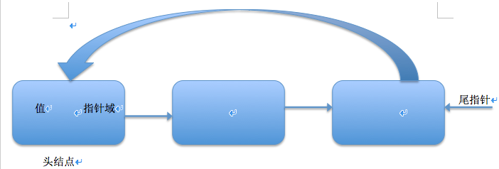
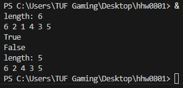

# CircularDoublyLinkedList 11024151
---

## 題目二: Python實作的單向循環鏈錶功能範例
### 一、概述：
单向循环链表是指在单链表的基础上，表的最后一个元素指向链表头结点，不再是为空。

由图可知，单向循环链表的判断条件不再是表为空了，而变成了是否到表头。

### 二、操作
is_empty() 判断链表是否为空
length() 返回链表的长度
travel() 遍历
add(item) 在头部添加一个节点
append(item) 在尾部添加一个节点
insert(pos, item) 在指定位置pos添加节点
remove(item) 删除一个节点
search(item) 查找节点是否存在

### 三、具体代码
- `test.py`：單向循環鏈表實作程式碼

### 四、VS Code 開發截圖  

### 五、執行結果截圖  

### 六、測試說明  
1. 依照原作者文章輸入相同測資  
2. 執行結果與原文比對一致  
3. 確認程式可正常執行無誤

---
